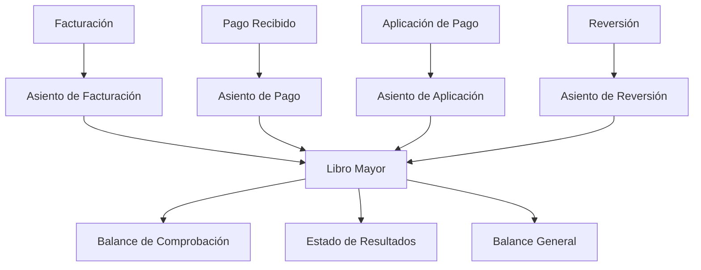
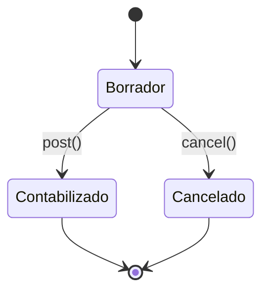
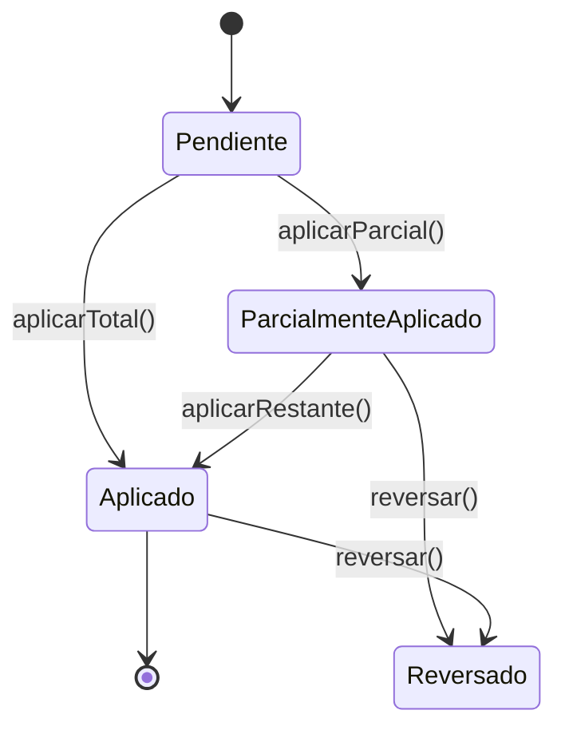

# 📊 FLUJO CONTABLE AUTOMATIZADO - Tavira

## 🎯 Resumen Ejecutivo

Tavira implementa un sistema contable automatizado que genera asientos contables en tiempo real siguiendo las normas colombianas (Decreto 2650). Cada transacción financiera (facturación, pagos, reversiones) produce automáticamente sus respectivos documentos contables.

## 🏗️ Arquitectura del Sistema Contable

### Componentes Principales



### Modelos Contables Core

- **`ChartOfAccounts`**: Plan de cuentas siguiendo Decreto 2650
- **`AccountingTransaction`**: Asientos contables (cabecera)
- **`AccountingTransactionEntry`**: Movimientos contables (detalle)
- **`Budget`**: Presupuestos anuales
- **`BudgetExecution`**: Ejecución presupuestal

## 📈 Flujos Contables Automatizados

### 1. 🧾 Flujo de Facturación

#### Evento Disparador
```php
// Al crear una factura
Invoice::create([...]) → InvoiceCreated Event
```

#### Asiento Contable Generado
```
ASIENTO: Facturación de Administración
FECHA: [billing_date]
REFERENCIA: Invoice #[invoice_id]

DÉBITO:  130501 - Cartera de Administración    $XXX
CRÉDITO: 420001 - Ingresos por Administración  $XXX
```

#### Código de Implementación
```php
// app/Listeners/GenerateAccountingEntryFromInvoice.php
public function handle(InvoiceCreated $event)
{
    $invoice = $event->invoice;
    
    $transaction = AccountingTransaction::create([
        'descripcion' => "Facturación {$invoice->numero_factura}",
        'fecha_transaccion' => $invoice->fecha_facturacion,
        'tipo_referencia' => 'factura',
        'id_referencia' => $invoice->id,
    ]);
    
    // Débito: Cartera
    $transaction->agregarMovimiento([
        'cuenta_id' => $this->obtenerCuentaPorCodigo('130501'),
        'descripcion' => 'Facturación servicios administración',
        'monto_debito' => $invoice->monto_total,
    ]);
    
    // Crédito: Ingresos
    $transaction->agregarMovimiento([
        'cuenta_id' => $this->obtenerCuentaPorCodigo('420001'),
        'descripcion' => 'Ingreso por administración',
        'monto_credito' => $invoice->monto_total,
    ]);
    
    $transaction->contabilizar();
}
```

### 2. 💰 Flujo de Pagos

#### Evento Disparador
```php
// Al recibir un pago
Payment::create([...]) → PaymentReceived Event
```

#### Asiento Contable Generado
```
ASIENTO: Recepción de Pago
FECHA: [payment_date]
REFERENCIA: Payment #[payment_id]

DÉBITO:  111001 - Caja/Banco                   $XXX
CRÉDITO: 130501 - Cartera de Administración    $XXX
```

#### Estados de Pago y Asientos

##### 🟡 Pago Pendiente (pendiente)
```sql
estado: 'pendiente'
monto_total: 450000
monto_aplicado: 0
monto_restante: 450000
```
**Sin asiento contable** hasta aplicación.

##### 🔵 Pago Parcialmente Aplicado (parcialmente_aplicado)
```sql
estado: 'parcialmente_aplicado'
monto_total: 450000
monto_aplicado: 100000
monto_restante: 350000
```

**Asiento por aplicación parcial:**
```
DÉBITO:  111001 - Caja/Banco           $100,000
CRÉDITO: 130501 - Cartera Admin        $100,000
```

##### 🟢 Pago Completamente Aplicado (aplicado)
```sql
estado: 'aplicado'
monto_total: 450000
monto_aplicado: 450000
monto_restante: 0
```

**Asiento por aplicación completa:**
```
DÉBITO:  111001 - Caja/Banco           $450,000
CRÉDITO: 130501 - Cartera Admin        $450,000
```

### 3. 🔄 Flujo de Aplicación de Pagos

#### Evento Disparador
```php
// Al aplicar pago a facturas
$pago->aplicarAFacturas() → PaymentApplication Created
```

#### Lógica FIFO (First In, First Out)
```php
// Aplicación automática por antigüedad
$facturasPendientes = Invoice::where('apartamento_id', $pago->apartamento_id)
    ->whereIn('estado', ['pendiente', 'pago_parcial', 'vencida'])
    ->orderBy('fecha_facturacion', 'asc') // FIFO
    ->get();
```

#### Asientos por Tipo de Aplicación

##### Aplicación Parcial
```
ASIENTO: Aplicación Pago Parcial
REFERENCIA: PaymentApplication #[id]

DÉBITO:  111001 - Caja/Banco                    $100,000
CRÉDITO: 130501 - Cartera Administración        $100,000
```

##### Aplicación Total
```
ASIENTO: Aplicación Pago Total
REFERENCIA: PaymentApplication #[id]

DÉBITO:  111001 - Caja/Banco                    $450,000
CRÉDITO: 130501 - Cartera Administración        $450,000
```

### 4. ↩️ Flujo de Reversiones

#### Evento Disparador
```php
// Al reversar aplicación de pago
$aplicacion->reversar() → Genera asiento de reversión
```

#### Asiento de Reversión
```
ASIENTO: Reversión Aplicación Pago
FECHA: [fecha_revision]
REFERENCIA: PaymentApplicationReversal #[id]

DÉBITO:  130501 - Cartera Administración        $100,000
CRÉDITO: 111001 - Caja/Banco                    $100,000
```

## 📋 Plan de Cuentas (Decreto 2650)

### Estructura Jerárquica

```
1. ACTIVO
   11. DISPONIBLE
       111. CAJA
           111001 - Caja General
           111002 - Caja Menor
       112. BANCOS
           112001 - Banco Davivienda
           112002 - Banco Bancolombia
   
   13. DEUDORES
       130. CLIENTES
           130501 - Cartera Administración
           130502 - Cartera Cuotas Extraordinarias

4. INGRESOS
   42. INGRESOS OPERACIONALES
       420. SERVICIOS
           420001 - Ingresos por Administración
           420002 - Ingresos Cuotas Extraordinarias
```

### Cuentas Principales Utilizadas

| Código | Nombre | Tipo | Descripción |
|--------|--------|------|-------------|
| 111001 | Caja/Banco | Activo | Dinero disponible |
| 130501 | Cartera Administración | Activo | Cuentas por cobrar |
| 420001 | Ingresos por Administración | Ingreso | Ingresos operacionales |
| 520001 | Gastos Administrativos | Gasto | Gastos de operación |

## 🔍 Trazabilidad y Auditoría

### Sistema de Referencias
```php
AccountingTransaction {
    tipo_referencia: 'factura' | 'pago' | 'aplicacion_pago' | 'reversion'
    id_referencia: [ID del documento origen]
    numero_transaccion: 'ACC-202408-0001'
    estado: 'borrador' | 'contabilizado' | 'cancelado'
}
```

### Cadena de Trazabilidad
```
Factura INV-202408-0504
    ↓
Asiento ACC-202408-0001 (Facturación)
    ↓
Pago PAY-202408-0010
    ↓
Aplicación PayApp-#123
    ↓
Asiento ACC-202408-0002 (Aplicación)
    ↓
Actualización de Balances
```

## 🎯 Rutas y Accesos

### Módulo de Contabilidad
- **Principal**: `/accounting/transactions`
- **Plan de Cuentas**: `/accounting/chart-of-accounts`
- **Presupuestos**: `/accounting/budgets`
- **Reportes**: `/accounting/reports`

### Filtros Disponibles
```php
// Por tipo de referencia
?reference_type=payment_application

// Por período
?start_date=2024-08-01&end_date=2024-08-31

// Por estado
?status=posted

// Búsqueda de texto
?search=PAY-202408-0010
```

### Reportes Contables

#### Balance de Comprobación
- **Ruta**: `/accounting/reports/trial-balance`
- **Muestra**: Saldos débito/crédito por cuenta
- **Período**: Configurable

#### Estado de Resultados
- **Ruta**: `/accounting/reports/income-statement`
- **Muestra**: Ingresos vs Gastos
- **Período**: Mensual/Anual

#### Balance General
- **Ruta**: `/accounting/reports/balance-sheet`
- **Muestra**: Activos, Pasivos, Patrimonio
- **Corte**: Por fecha específica

## 🔄 Estados y Transiciones

### Estados de Asientos Contables



#### 🟡 Borrador (borrador)
- Asiento creado pero no confirmado
- Se puede modificar o eliminar
- No afecta reportes oficiales

#### 🟢 Contabilizado (contabilizado)
- Asiento confirmado y cerrado
- Afecta todos los balances
- Solo se puede reversar (no modificar)

#### 🔴 Cancelado (cancelado)
- Asiento anulado antes de contabilizar
- No afecta balances
- Mantiene historial para auditoría

### Estados de Pagos



## 🛠️ Implementación Técnica

### Listeners de Eventos
```php
// app/Providers/EventServiceProvider.php
protected $listen = [
    InvoiceCreated::class => [
        GenerateAccountingEntryFromInvoice::class,
    ],
    PaymentReceived::class => [
        GenerateAccountingEntryFromPayment::class,
    ],
    AccountingTransactionPosted::class => [
        UpdateBudgetExecutionFromTransaction::class,
    ],
];
```

### Middleware de Auditoría
```php
// Cada transacción contable registra:
- usuario_creacion
- fecha_creacion
- usuario_contabilizacion
- fecha_contabilizacion
- direccion_ip
- agente_usuario
```

### Validaciones de Integridad
```php
// Validación de partida doble
public function validarPartidaDoble(): bool
{
    $totalDebitos = $this->movimientos()->sum('monto_debito');
    $totalCreditos = $this->movimientos()->sum('monto_credito');
    
    return abs($totalDebitos - $totalCreditos) < 0.01; // Tolerancia de centavos
}
```

## 📊 Métricas y KPIs

### Indicadores Financieros Automatizados
- **Cartera Vencida**: Facturas > 30 días
- **Liquidez**: Caja/Banco disponible
- **Recaudo Mensual**: Pagos del período
- **Morosidad**: % de apartamentos en mora

### Dashboard Contable
```php
// Métricas en tiempo real
$metricas = [
    'saldo_caja' => ChartOfAccounts::saldoPorCodigo('111001'),
    'cartera_total' => ChartOfAccounts::saldoPorCodigo('130501'),
    'ingresos_mes' => AccountingTransaction::ingresosMes(),
    'gastos_mes' => AccountingTransaction::gastosMes(),
];
```

## 🔒 Seguridad y Controles

### Permisos por Rol
- **`ver_contabilidad`**: Ver asientos y reportes
- **`crear_asientos`**: Crear asientos manuales
- **`contabilizar_asientos`**: Confirmar asientos
- **`ver_reportes_contables`**: Acceso a reportes

### Controles de Integridad
- **Inmutabilidad**: Asientos contabilizados no se pueden modificar
- **Auditoría**: Registro completo de cambios
- **Balances**: Validación automática de partida doble
- **Períodos**: Control de cierre de períodos contables

## 🚀 Próximas Mejoras

### Funcionalidades Planificadas
- [ ] Cierre de períodos contables
- [ ] Asientos de ajuste automáticos
- [ ] Integración con bancos (API)
- [ ] Reportes NIIF
- [ ] Conciliación bancaria automática
- [ ] Facturación electrónica DIAN

---

**Documento generado automáticamente - Tavira v1.0**  
**Fecha**: Agosto 2024  
**Última actualización**: `date('Y-m-d H:i:s')`