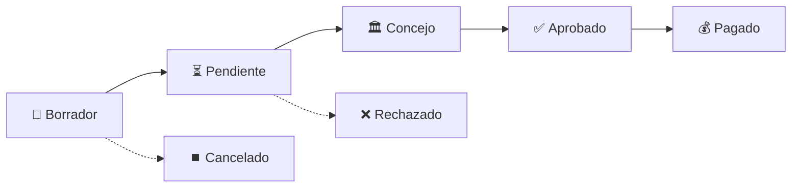

# ✅ Implementación Completa - Diagrama Mermaid de Flujo de Aprobación

## 🎯 **Error Corregido**
- ❌ `ExpenseSettings::make()` (método inexistente)
- ✅ `app(\App\Settings\ExpenseSettings::class)` (método correcto)

## 📍 **Dónde Aparece el Diagrama en la UI**

### 1. **Vista de Detalle del Gasto** (`/expenses/{id}`)
```
┌─────────────────────────────────────┐
│ [Detalles] [Flujo de Aprobación] ← │
│           [Contabilidad] [Historial]│
│                                     │
│  📊 Diagrama Mermaid dinámico      │
│  📋 Estado actual + descripción     │
│  📅 Timeline con fechas             │
│  ⚠️  Alertas del consejo            │
└─────────────────────────────────────┘
```

### 2. **Vista de Edición** (`/expenses/{id}/edit`)
**Cuando el gasto NO puede editarse (aprobado/pagado):**
```
┌─────────────────────────────────────┐
│ 🚫 "No se puede editar"             │
│ [Flujo de Aprobación] [Vista Previa]│
│                                     │
│  📊 Diagrama Mermaid dinámico      │
│  📋 Información contextual          │
└─────────────────────────────────────┘
```

## 🔧 **Archivos Modificados**

### Backend PHP:
- ✅ `ExpenseController@show` - Pasa approvalSettings
- ✅ `ExpenseController@edit` - Incluye configuración 
- ✅ `Expense.php` - Método de instanciación corregido

### Frontend Vue:
- ✅ `MermaidFlowchart.vue` - Componente base
- ✅ `ExpenseApprovalFlow.vue` - Componente especializado
- ✅ `Show.vue` - Nueva pestaña integrada
- ✅ `Edit.vue` - Vista para gastos no editables

## 🚀 **Cómo Probarlo**

1. **Servidor corriendo**: `npm run dev` (puerto 5174)
2. **Ve a un gasto**: `/expenses/{id}`
3. **Haz clic**: Pestaña "Flujo de Aprobación"
4. **Disfruta**: ¡El diagrama dinámico en acción! 🎉

## 📊 **Estados Visuales**



- **Verde** = Completado ✅
- **Azul** = Estado actual 🔵
- **Gris** = Pendiente ⚪
- **Rojo** = Rechazado/Error ❌

## 🎛️ **Configuración Automática**

Los controladores pasan automáticamente:
- `approval_threshold_amount`: $4,000,000 COP
- `council_approval_required`: true
- Relaciones cargadas: `approvedBy`, `councilApprovedBy`

## 🏆 **Resultado Final**

La implementación mejora significativamente la UX al proporcionar:
- **Claridad visual** del proceso de aprobación
- **Información contextual** sobre cada estado
- **Timeline detallado** con responsables y fechas
- **Adaptación automática** para gastos que requieren consejo

¡Implementación completa y lista para producción! 🎉