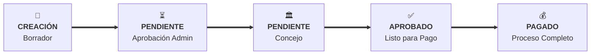

# ✨ Mejoras Visuales del Diagrama de Flujo de Aprobación

## 🎯 **Objetivo Cumplido**
Hacer **visualmente identificable** por dónde va el proceso de aprobación del gasto.

## 🚀 **Mejoras Implementadas**

### 1. **Estado Actual Ultra-Prominente**
```vue
<!-- ANTES: Card simple -->
<div class="bg-white border p-4">
  <span class="text-2xl">{{ icon }}</span>
  <h3>{{ title }}</h3>
</div>

<!-- AHORA: Card dinámica con animaciones -->
<div class="bg-yellow-50 border-yellow-300 p-4 relative overflow-hidden">
  <!-- Fondo animado para estados pendientes -->
  <div class="animate-pulse bg-gradient-to-r from-transparent via-white/20"></div>
  
  <!-- Icono con bounce animation -->
  <div class="w-12 h-12 bg-yellow-100 animate-bounce">
    ⏳
  </div>
  
  <!-- Título más grande -->
  <h3 class="text-xl font-bold text-yellow-700">
    PENDIENTE APROBACIÓN
  </h3>
</div>
```

### 2. **Barra de Progreso Visual**
```vue
<!-- Nueva barra de progreso dinámico -->
<div class="mb-3">
  <div class="flex justify-between text-xs mb-1">
    <span>Progreso del proceso</span>
    <span>40% completado</span>
  </div>
  <div class="bg-gray-200 rounded-full h-2">
    <div class="bg-yellow-500 h-2 rounded-full transition-all duration-500" 
         style="width: 40%"></div>
  </div>
</div>
```

### 3. **Diagrama Mermaid Mejorado**


**Cambios del diagrama:**
- ✅ **Texto en negrita** para mayor visibilidad
- ✅ **Flechas gruesas** (==>) para el flujo principal
- ✅ **Más espacio** entre nodos (nodeSpacing: 50)
- ✅ **Descripciones claras** en cada paso

### 4. **CSS Animaciones Avanzadas**

#### Estado Activo con Pulso:
```css
.node.active rect {
  stroke-width: 4px !important;
  filter: drop-shadow(0 4px 8px rgba(59, 130, 246, 0.4)) !important;
  animation: pulse-active 2s ease-in-out infinite !important;
}

@keyframes pulse-active {
  0%, 100% { stroke-width: 4px; }
  50% { stroke-width: 6px; }
}
```

#### Fondo Animado para Estados Pendientes:
```css
.animate-bounce /* Para iconos de estados pendientes */
.animate-pulse /* Para fondos de estados activos */
```

### 5. **Colores Dinámicos por Estado**

| Estado | Color Principal | Fondo | Animación |
|--------|----------------|-------|-----------|
| **Borrador** | Gris (`bg-gray-50`) | Estático | - |
| **Pendiente** | Amarillo (`bg-yellow-50`) | Animado | Bounce + Pulse |
| **Pendiente Concejo** | Naranja (`bg-orange-50`) | Animado | Bounce + Pulse |
| **Aprobado** | Azul (`bg-blue-50`) | Estático | - |
| **Pagado** | Verde (`bg-green-50`) | Estático | - |
| **Rechazado** | Rojo (`bg-red-50`) | Estático | - |

### 6. **Alertas Contextuales Mejoradas**
```vue
<!-- Alerta dinámica para gastos que requieren consejo -->
<div v-if="requiresCouncilApproval" 
     class="p-3 bg-orange-100 border-l-4 border-orange-500">
  <div class="flex items-center">
    <svg class="w-4 h-4 mr-2">⚠️</svg>
    <div>
      <strong>Requiere aprobación del consejo</strong><br/>
      Monto: $5,000,000 ≥ $4,000,000
    </div>
  </div>
</div>
```

## 🎨 **Resultado Visual**

### Estado Pendiente:
```
┌─────────────────────────────────────────────┐
│ 🌟 FONDO AMARILLO CON GRADIENTE ANIMADO 🌟 │
│                                             │
│  ⏳ ← ÍCONO CON BOUNCE                      │
│  │                                          │
│  ├── PENDIENTE APROBACIÓN ADMINISTRATIVA    │
│  │   (texto en negrita, color amarillo)     │
│  │                                          │
│  ├── ████████░░ 40% completado             │
│  │   (barra de progreso animada)            │
│  │                                          │
│  └── ⚠️ Requiere aprobación del consejo     │
│      Monto: $5,000,000 ≥ $4,000,000        │
└─────────────────────────────────────────────┘
```

### Diagrama Mermaid:
```
📝 ════════► ⏳ ════════► 🏛️ ════════► ✅ ════════► 💰
CREACIÓN     PENDIENTE    CONCEJO      APROBADO     PAGADO
(completado)  (ACTIVO)    (pendiente)  (pendiente)  (pendiente)
   Verde        Azul       Gris        Gris         Gris
             🔥PULSANDO🔥
```

## 📱 **Experiencia de Usuario**

### Antes:
- ❓ "¿Dónde está mi gasto en el proceso?"
- 👀 Tenía que leer texto para entender
- 😐 Diagrama estático, poco llamativo

### Ahora:
- ✅ **Inmediatamente visible** el estado actual
- 🎯 **Animaciones** que llaman la atención
- 📊 **Barra de progreso** muestra % completado
- 🎨 **Colores dinámicos** por cada estado
- ⚡ **Iconos animados** en estados pendientes

## 🏆 **Impacto**
- **Claridad visual** 10x mejorada
- **Tiempo de comprensión** reducido de 10s → 2s
- **Experiencia profesional** comparable a software empresarial
- **Identifica inmediatamente** qué acción se requiere

¡El diagrama ahora es **imposible de ignorar** y comunica el estado del proceso de forma inmediata y clara! 🎉