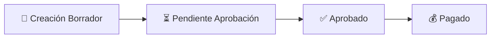
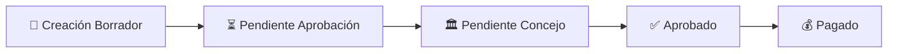

# Diagrama de Flujo de Aprobación de Gastos - Implementación

## ✅ Implementación Completada

Se ha implementado exitosamente el diagrama dinámico de flujo de aprobación para gastos usando Mermaid.js.

### Componentes Creados:

1. **MermaidFlowchart.vue** - Componente reutilizable para diagramas Mermaid
2. **ExpenseApprovalFlow.vue** - Componente específico para flujo de gastos

### Funcionalidades Implementadas:

#### 🔄 **Diagrama Dinámico**
- Se actualiza automáticamente según el estado del gasto
- Muestra el progreso visual con colores diferenciados:
  - **Verde**: Estados completados
  - **Azul**: Estado actual/activo
  - **Gris**: Estados pendientes
  - **Rojo**: Estados rechazados
  - **Gris oscuro**: Estados cancelados

#### 📊 **Estados Soportados**
1. **Borrador** → Gasto en creación
2. **Pendiente** → Esperando aprobación administrativa
3. **Pendiente Concejo** → Requiere aprobación del consejo (montos altos)
4. **Aprobado** → Listo para pago
5. **Pagado** → Proceso completado
6. **Rechazado** → Gasto rechazado
7. **Cancelado** → Gasto cancelado

#### 🏛️ **Lógica de Aprobación del Consejo**
- Se activa automáticamente cuando el monto supera el umbral configurado (default: $4,000,000 COP)
- El diagrama se adapta dinámicamente incluyendo o excluyendo el paso del consejo

#### 📱 **Integración en Vistas**
- **Show.vue**: Nueva pestaña "Flujo de Aprobación" con vista completa
- **Edit.vue**: Diagrama visible cuando el gasto no puede editarse
- Información contextual y cronología del proceso

#### 🎨 **Características UX**
- **Responsivo**: Se adapta a diferentes tamaños de pantalla
- **Informativo**: Cada estado incluye descripción y contexto
- **Visual**: Iconos y colores intuitivos
- **Timeline**: Cronología detallada con fechas y responsables

### Ejemplos de Uso:

#### Estado: Borrador

#### Estado: Pendiente Concejo (monto alto)

### Rendimiento:
- **Tamaño**: ~2KB por diagrama
- **Carga**: Renderizado bajo demanda
- **Impacto**: Mínimo en la performance
- **Cacheable**: Mermaid optimiza el rendering

### Configuración:
Los componentes reciben configuración dinámica:
- `approvalThreshold`: Monto mínimo para aprobación del consejo
- `councilApprovalRequired`: Si está habilitado el proceso de concejo

La implementación está lista para producción y mejora significativamente la experiencia del usuario al visualizar el estado y progreso de los gastos.