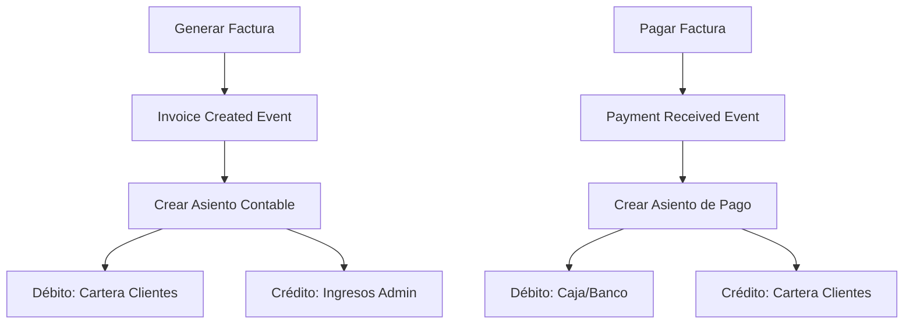
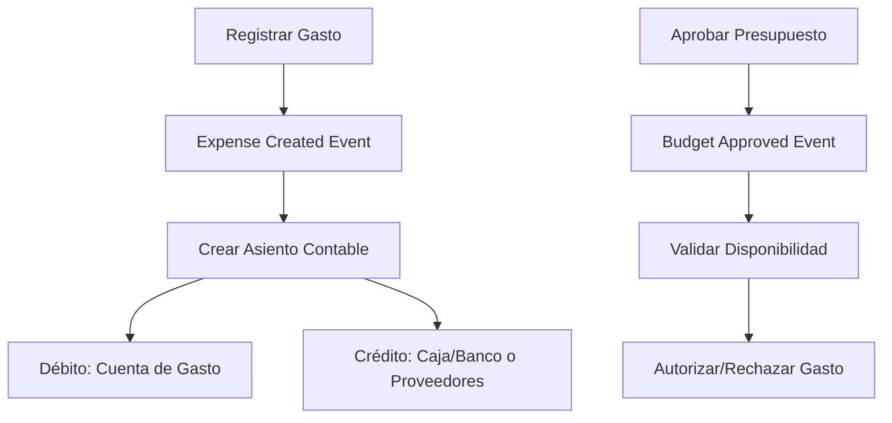

# Diseño del Sistema Contable - Habitta

> **Estado:** ✅ IMPLEMENTADO - Backend Core Completado  
> **Fecha:** 2025-08-01  
> **Progreso:** 45%

## 1. Plan de Cuentas (Chart of Accounts)

### 1.1 Estructura Jerárquica

```
ChartOfAccounts
├── AccountType (Clase de Cuenta)
│   ├── 1 - ACTIVOS
│   ├── 2 - PASIVOS  
│   ├── 3 - PATRIMONIO
│   ├── 4 - INGRESOS
│   └── 5 - GASTOS
├── AccountGroup (Grupo de Cuentas)
│   ├── 11 - Disponible
│   ├── 13 - Deudores
│   ├── 21 - Obligaciones Financieras
│   └── ...
├── Account (Cuenta Principal)
│   ├── 1105 - Caja
│   ├── 1110 - Bancos
│   ├── 1305 - Clientes
│   └── ...
└── SubAccount (Subcuenta)
    ├── 110501 - Caja General
    ├── 111001 - Banco Bogotá CTA 123
    └── ...
```

### 1.2 Modelo de Datos - ChartOfAccounts

```php
// Tabla: chart_of_accounts
{
    id: bigint,
    conjunto_config_id: bigint, // Referencia al conjunto
    code: string(10), // Código contable (ej: "1105")
    name: string(200), // Nombre de la cuenta
    description: text, // Descripción detallada
    account_type: enum('asset', 'liability', 'equity', 'income', 'expense'),
    parent_id: bigint|null, // Para jerarquía de cuentas
    level: tinyint, // Nivel en la jerarquía (1=clase, 2=grupo, 3=cuenta, 4=subcuenta)
    is_active: boolean,
    requires_third_party: boolean, // Si requiere tercero (clientes, proveedores)
    nature: enum('debit', 'credit'), // Naturaleza de la cuenta
    accepts_posting: boolean, // Si acepta movimientos directos
    created_at: timestamp,
    updated_at: timestamp
}
```

### 1.3 Plan de Cuentas Base Colombiano para Propiedad Horizontal

```
1. ACTIVOS
  11. DISPONIBLE
    1105. Caja
      110501. Caja General
      110502. Caja Menor
    1110. Bancos
      111001. Banco Principal - Cuenta Corriente
      111002. Banco Ahorros - Fondo Reserva
      111003. Banco CDT - Inversiones

  13. DEUDORES
    1305. Clientes (Propietarios)
      130501. Cartera Administración
      130502. Cartera Cuotas Extraordinarias
      130503. Cartera Intereses Mora
    1355. Anticipos y Avances
      135501. Anticipos a Proveedores
      135502. Avances a Empleados

2. PASIVOS
  21. OBLIGACIONES FINANCIERAS
    2105. Bancos Nacionales
      210501. Préstamos Bancarios
      210502. Sobregiros Bancarios
  
  23. PROVEEDORES
    2305. Nacionales
      230501. Proveedores de Servicios
      230502. Contratistas Mantenimiento

  25. OBLIGACIONES LABORALES
    2505. Salarios por Pagar
    2510. Cesantías Consolidadas
    2515. Intereses sobre Cesantías

3. PATRIMONIO
  31. CAPITAL SOCIAL
    3105. Capital Pagado
      310501. Fondo Social del Conjunto
  
  32. RESERVAS
    3205. Reservas Obligatorias
      320501. Fondo de Reserva (Ley 675)
      320502. Reserva para Reposición
  
  36. RESULTADOS DEL EJERCICIO
    3605. Utilidad del Ejercicio
    3610. Pérdidas del Ejercicio

4. INGRESOS
  41. OPERACIONALES
    4135. Comercio al por Mayor y Menor
      413501. Cuotas de Administración
      413502. Cuotas Extraordinarias
      413503. Parqueaderos
      413504. Salón Social
      413505. Multas y Sanciones
      413506. Intereses de Mora
  
  42. NO OPERACIONALES
    4210. Financieros
      421001. Rendimientos Financieros
      421002. Descuentos Comerciales

5. GASTOS
  51. OPERACIONALES DE ADMINISTRACIÓN
    5105. Gastos de Personal
      510501. Sueldos y Salarios
      510502. Cesantías
      510503. Intereses sobre Cesantías
      510504. Prima de Servicios
      510505. Vacaciones
      510510. Aportes a EPS
      510515. Aportes a ARP
      510520. Aportes Parafiscales
    
    5110. Honorarios
      511001. Revisoria Fiscal
      511002. Asesoría Jurídica
      511003. Asesoría Contable
    
    5115. Impuestos
      511501. Industria y Comercio
      511502. Predial
      511503. Valorización
    
    5120. Arrendamientos
      512001. Oficina Administración
      512002. Parqueaderos Visitantes
    
    5135. Servicios
      513501. Energía Eléctrica
      513502. Acueducto y Alcantarillado
      513503. Teléfono
      513504. Internet
      513505. Televisión/Cable
      513506. Gas Natural
      513507. Recolección Basuras
      513508. Vigilancia
      513509. Jardinería
      513510. Limpieza Zonas Comunes
      513511. Mantenimiento Ascensores
      513512. Mantenimiento Equipos
    
    5140. Gastos Legales
      514001. Notariales
      514002. Registro y Anotación
    
    5145. Mantenimiento y Reparaciones
      514501. Construcciones y Edificaciones
      514502. Maquinaria y Equipo
      514503. Equipo de Oficina
    
    5150. Adecuación e Instalación
      515001. Instalaciones Eléctricas
      515002. Arreglos Ornamentales
    
    5155. Gastos de Viaje
      515501. Alojamiento y Manutención
      515502. Pasajes
    
    5160. Depreciaciones
      516001. Construcciones y Edificaciones
      516002. Maquinaria y Equipo
      516003. Equipo de Oficina
    
    5195. Diversos
      519501. Multas y Sanciones
      519502. Donaciones
      519503. Gastos Extraordinarios

52. OPERACIONALES DE VENTAS
    (Aplicable si el conjunto tiene ingresos comerciales)

53. NO OPERACIONALES
    5305. Financieros
      530501. Gastos Bancarios
      530502. Comisiones
      530503. Intereses
    
    5395. Gastos Extraordinarios
      539501. Pérdidas en Ventas de Activos
      539502. Gastos de Ejercicios Anteriores
```

## 2. Sistema de Transacciones Contables

### 2.1 Modelo de Datos - AccountingTransaction

```php
// Tabla: accounting_transactions
{
    id: bigint,
    conjunto_config_id: bigint,
    transaction_number: string(20), // Número consecutivo
    transaction_date: date,
    description: text,
    reference_type: string|null, // 'invoice', 'payment', 'manual', etc.
    reference_id: bigint|null, // ID del documento origen
    total_debit: decimal(15,2),
    total_credit: decimal(15,2),
    status: enum('draft', 'posted', 'cancelled'),
    created_by: bigint,
    posted_by: bigint|null,
    posted_at: timestamp|null,
    created_at: timestamp,
    updated_at: timestamp
}

// Tabla: accounting_transaction_entries (Detalle de asientos)
{
    id: bigint,
    accounting_transaction_id: bigint,
    account_id: bigint, // Referencia a chart_of_accounts
    description: text,
    debit_amount: decimal(15,2),
    credit_amount: decimal(15,2),
    third_party_type: string|null, // 'apartment', 'supplier', etc.
    third_party_id: bigint|null,
    cost_center_id: bigint|null,
    created_at: timestamp,
    updated_at: timestamp
}
```

### 2.2 Reglas de Negocio - Partida Doble

```php
class AccountingTransaction {
    // Validación automática de partida doble
    public function validateDoubleEntry(): bool {
        return $this->total_debit === $this->total_credit;
    }
    
    // Posting automático con validaciones
    public function post(): void {
        if (!$this->validateDoubleEntry()) {
            throw new InvalidDoubleEntryException();
        }
        
        $this->status = 'posted';
        $this->posted_at = now();
        $this->posted_by = auth()->id();
        $this->save();
    }
}
```

### 2.3 Integración Automática con Sistema Existente

```php
// Event Listeners para generación automática
class InvoiceCreated {
    public function handle(InvoiceCreated $event): void {
        $invoice = $event->invoice;
        
        // Generar asiento automático
        AccountingTransaction::create([
            'reference_type' => 'invoice',
            'reference_id' => $invoice->id,
            'description' => "Factura {$invoice->invoice_number}",
            'entries' => [
                // Débito: Cartera de clientes
                [
                    'account_code' => '130501',
                    'debit_amount' => $invoice->total_amount,
                    'third_party_type' => 'apartment',
                    'third_party_id' => $invoice->apartment_id
                ],
                // Crédito: Ingresos por administración
                [
                    'account_code' => '413501',
                    'credit_amount' => $invoice->total_amount
                ]
            ]
        ]);
    }
}
```

## 3. Sistema de Presupuesto

### 3.1 Modelo de Datos - Budget

```php
// Tabla: budgets
{
    id: bigint,
    conjunto_config_id: bigint,
    name: string(200),
    fiscal_year: year,
    start_date: date,
    end_date: date,
    total_budgeted_income: decimal(15,2),
    total_budgeted_expenses: decimal(15,2),
    status: enum('draft', 'approved', 'active', 'closed'),
    approved_by: bigint|null,
    approved_at: timestamp|null,
    created_at: timestamp,
    updated_at: timestamp
}

// Tabla: budget_items
{
    id: bigint,
    budget_id: bigint,
    account_id: bigint, // Referencia a chart_of_accounts
    category: string(100), // 'income', 'expense'
    budgeted_amount: decimal(15,2),
    jan_amount: decimal(15,2),
    feb_amount: decimal(15,2),
    // ... otros meses
    dec_amount: decimal(15,2),
    notes: text|null,
    created_at: timestamp,
    updated_at: timestamp
}

// Tabla: budget_execution (Vista materializada o calculada)
{
    id: bigint,
    budget_item_id: bigint,
    period_month: tinyint,
    period_year: year,
    budgeted_amount: decimal(15,2),
    actual_amount: decimal(15,2),
    variance_amount: decimal(15,2),
    variance_percentage: decimal(5,2),
    created_at: timestamp,
    updated_at: timestamp
}
```

### 3.2 Categorías Presupuestales Específicas

```
INGRESOS:
- Cuotas de Administración Ordinarias
- Cuotas Extraordinarias
- Multas y Sanciones
- Ingresos por Parqueaderos
- Rendimientos Financieros
- Otros Ingresos

GASTOS OPERACIONALES:
- Personal Administrativo
- Servicios Públicos
- Mantenimiento y Reparaciones
- Vigilancia y Seguridad
- Limpieza y Jardinería
- Seguros
- Honorarios Profesionales
- Gastos Administrativos

GASTOS DE RESERVA:
- Fondo de Reserva (mínimo legal)
- Proyectos de Mejoramiento
- Reposiciones de Activos
```

## 4. Reportes Financieros

### 4.1 Balance General (Estado de Situación Financiera)

```php
class BalanceSheetReport {
    public function generate(Carbon $date): array {
        return [
            'assets' => [
                'current_assets' => [
                    'cash_and_equivalents' => $this->getCashBalance($date),
                    'accounts_receivable' => $this->getReceivablesBalance($date),
                    'prepaid_expenses' => $this->getPrepaidBalance($date)
                ],
                'non_current_assets' => [
                    'property_equipment' => $this->getFixedAssetsBalance($date),
                    'accumulated_depreciation' => $this->getDepreciationBalance($date)
                ]
            ],
            'liabilities' => [
                'current_liabilities' => [
                    'accounts_payable' => $this->getPayablesBalance($date),
                    'accrued_expenses' => $this->getAccruedBalance($date)
                ],
                'long_term_liabilities' => [
                    'loans_payable' => $this->getLoansBalance($date)
                ]
            ],
            'equity' => [
                'social_fund' => $this->getSocialFundBalance($date),
                'reserve_fund' => $this->getReserveFundBalance($date),
                'retained_earnings' => $this->getRetainedEarningsBalance($date),
                'current_year_result' => $this->getCurrentYearResult($date)
            ]
        ];
    }
}
```

### 4.2 Estado de Resultados (P&L)

```php
class IncomeStatementReport {
    public function generate(Carbon $startDate, Carbon $endDate): array {
        return [
            'operating_income' => [
                'administration_fees' => $this->getAdministrationIncome($startDate, $endDate),
                'extraordinary_fees' => $this->getExtraordinaryIncome($startDate, $endDate),
                'penalties_fines' => $this->getPenaltiesIncome($startDate, $endDate),
                'other_income' => $this->getOtherIncome($startDate, $endDate)
            ],
            'operating_expenses' => [
                'personnel_expenses' => $this->getPersonnelExpenses($startDate, $endDate),
                'utilities' => $this->getUtilitiesExpenses($startDate, $endDate),
                'maintenance' => $this->getMaintenanceExpenses($startDate, $endDate),
                'security' => $this->getSecurityExpenses($startDate, $endDate),
                'administrative' => $this->getAdministrativeExpenses($startDate, $endDate)
            ],
            'non_operating' => [
                'financial_income' => $this->getFinancialIncome($startDate, $endDate),
                'financial_expenses' => $this->getFinancialExpenses($startDate, $endDate)
            ]
        ];
    }
}
```

## 5. Flujos de Integración

### 5.1 Flujo de Facturación → Contabilidad



### 5.2 Flujo de Gastos → Contabilidad



### 5.3 Cierre Mensual Automatizado

```php
class MonthlyClosingService {
    public function executeMonthlyClosing(int $year, int $month): void {
        // 1. Calcular intereses de mora automáticamente
        $this->calculateLateFees($year, $month);
        
        // 2. Generar depreciaciones
        $this->generateDepreciations($year, $month);
        
        // 3. Ajustar fondo de reserva
        $this->adjustReserveFund($year, $month);
        
        // 4. Generar reportes automáticos
        $this->generateMonthlyReports($year, $month);
        
        // 5. Validar cuadre contable
        $this->validateAccountingBalance($year, $month);
    }
}
```

---

## ✅ Estado de Implementación

### Completado (45%)
- [x] **Plan de Cuentas**: 60+ cuentas implementadas según Decreto 2650
- [x] **Transacciones Contables**: Partida doble con validaciones automáticas
- [x] **Integración Automática**: Eventos y listeners funcionando
- [x] **Base de Datos**: 6 tablas creadas y pobladas
- [x] **Validaciones**: Reglas de negocio implementadas

### En Desarrollo (30%)
- [ ] **Controladores API**: CRUD para todas las entidades
- [ ] **Sistema de Presupuesto**: Lógica de cálculos y alertas
- [ ] **Reportes**: Balance General, Estado de Resultados

### Pendiente (25%)
- [ ] **Frontend Vue.js**: Interfaces de usuario
- [ ] **Dashboard Contable**: Visualizaciones y gráficos
- [ ] **Testing**: Pruebas unitarias e integración

### Archivos Creados
```
app/Models/
├── ChartOfAccounts.php ✅
├── AccountingTransaction.php ✅
├── AccountingTransactionEntry.php ✅
├── Budget.php ✅
├── BudgetItem.php ✅
└── BudgetExecution.php ✅

app/Events/
├── InvoiceCreated.php ✅
└── PaymentReceived.php ✅

app/Listeners/
├── GenerateAccountingEntryFromInvoice.php ✅
└── GenerateAccountingEntryFromPayment.php ✅

database/migrations/
├── create_chart_of_accounts_table.php ✅
├── create_accounting_transactions_table.php ✅
├── create_accounting_transaction_entries_table.php ✅
├── create_budgets_table.php ✅
├── create_budget_items_table.php ✅
└── create_budget_executions_table.php ✅

database/seeders/
└── ChartOfAccountsSeeder.php ✅
```

Este diseño ha sido implementado exitosamente y proporciona la base técnica completa para el módulo contable integrado con el sistema existente de Habitta.