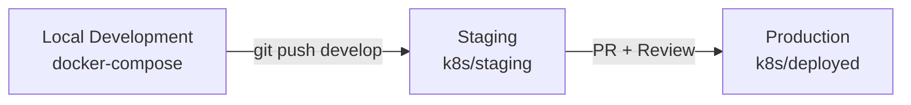

# Kubernetes Manifests - Tavira

Este directorio contiene todos los manifiestos de Kubernetes para los diferentes entornos de Tavira.

## 📁 Estructura de Directorios

```
k8s/
├── local/              # Kubernetes local (desarrollo con k8s)
├── staging/            # Ambiente de staging (rama develop)
├── deployed/           # Producción (rama main)
└── README.md          # Este archivo
```

## 🌍 Ambientes

### Local (local/)

**Propósito**: Desarrollo local usando Kubernetes (Orbstack, Minikube, etc.)

**⚠️ Nota**: Para desarrollo local, se recomienda usar **`docker-compose up -d`** en lugar de Kubernetes local.

- Ver [LOCAL-DEVELOPMENT.md](../LOCAL-DEVELOPMENT.md) para el flujo recomendado
- Este directorio es útil si prefieres desarrollar con k8s local
- Usa imágenes locales sin push a registry

**Cuando usar**:
- Quieres probar manifiestos de k8s localmente
- Prefieres k8s sobre docker-compose
- Estás desarrollando features específicas de k8s

### Staging (staging/)

**Propósito**: Ambiente de testing antes de producción

**Rama Git**: `develop`

**Deployment**:
- Automático al hacer push a `develop`
- GitHub Actions construye y despliega
- Imagen: `ingmontoyav/tavira-app:develop-<sha>`

**Características**:
- Recursos mínimos (1 replica)
- Debug mode habilitado
- Base de datos independiente
- URL: `https://staging.tavira.com.co`

**Documentación**: [staging/README.md](./staging/README.md)

### Producción (deployed/)

**Propósito**: Ambiente de producción

**Rama Git**: `main`

**Deployment**:
- Manual o automático tras PR aprobado
- GitHub Actions construye imagen
- Imagen: `ingmontoyav/tavira-app:v20251107-<sha>`

**Características**:
- Alta disponibilidad (2+ replicas)
- Debug mode deshabilitado
- Recursos optimizados
- URL: `https://tavira.com.co`

**Documentación**: [deployed/README.md](./deployed/README.md)

## 🔄 Flujo de Trabajo Completo



### 1. Desarrollo Local

```bash
# Usar docker-compose (recomendado)
docker-compose up -d
composer dev

# O Kubernetes local (opcional)
cd k8s/local
kubectl apply -f .
```

**Documentación**: [LOCAL-DEVELOPMENT.md](../LOCAL-DEVELOPMENT.md)

### 2. Push a Staging

```bash
# Hacer cambios en código
git add .
git commit -m "feat: nueva funcionalidad"
git push origin develop

# GitHub Actions despliega automáticamente a staging
```

**Ver deployment**:
```bash
kubectl get pods -l app=tavira-staging
kubectl logs -l app=tavira-staging -c php-fpm -f
```

### 3. Deploy a Producción

```bash
# Crear PR de develop a main
gh pr create --base main --head develop

# Después de review y merge, desplegar manualmente
kubectl set image deployment/tavira-app \
  php-fpm=ingmontoyav/tavira-app:v20251107-<sha> \
  copy-app=ingmontoyav/tavira-app:v20251107-<sha>

# Verificar deployment
kubectl rollout status deployment/tavira-app
kubectl get pods -l app=tavira
```

## 🎯 ¿Qué Ambiente Usar?

| Escenario | Ambiente | Comando |
|-----------|----------|---------|
| Desarrollo diario | Docker Compose | `docker-compose up -d` |
| Probar k8s localmente | Local K8s | `kubectl apply -f k8s/local/` |
| Testing antes de prod | Staging | `git push origin develop` |
| Deploy a usuarios | Producción | Merge PR + deploy manual |

## 📊 Comparación de Ambientes

| Característica | Local | Staging | Producción |
|---------------|-------|---------|------------|
| **Tool** | docker-compose | Kubernetes | Kubernetes |
| **Replicas** | 1 | 1 | 2+ |
| **CPU** | Sin límite | 50-300m | 100-500m |
| **Memory** | Sin límite | 128-256Mi | 256-512Mi |
| **Storage** | Volúmenes locales | 5Gi PVC | 10Gi PVC |
| **Debug** | true | true | false |
| **Hot Reload** | ✅ Sí | ❌ No | ❌ No |
| **Build Image** | ❌ No necesario | ✅ GitHub Actions | ✅ GitHub Actions |
| **Database** | Local PostgreSQL | K8s PostgreSQL | K8s PostgreSQL |

## 🛠️ Comandos Útiles

### Ver Contexto Actual
```bash
kubectl config current-context
```

### Cambiar entre Ambientes
```bash
# Producción (default)
kubectl config use-context default

# Staging
kubectl config use-context staging

# Local (Orbstack)
kubectl config use-context orbstack
```

### Ver Recursos por Ambiente

**Staging**:
```bash
kubectl get all -l environment=staging
```

**Producción**:
```bash
kubectl get all -l app=tavira
```

### Logs por Ambiente

**Staging**:
```bash
kubectl logs -l app=tavira-staging -c php-fpm --tail=100 -f
```

**Producción**:
```bash
kubectl logs -l app=tavira -c php-fpm --tail=100 -f
```

## 🔐 Secrets por Ambiente

Cada ambiente tiene su propio secret:

- **Local**: Variables en `.env` (no k8s secrets)
- **Staging**: `laravel-env-staging`
- **Producción**: `laravel-env`

### Ver Secrets
```bash
# Staging
kubectl get secret laravel-env-staging

# Producción
kubectl get secret laravel-env
```

### Actualizar Secrets
```bash
# Staging
kubectl patch secret laravel-env-staging \
  --type='json' -p='[{"op":"add","path":"/data/NEW_VAR","value":"'$(echo -n 'value' | base64)'"}]'

# Producción
kubectl patch secret laravel-env \
  --type='json' -p='[{"op":"add","path":"/data/NEW_VAR","value":"'$(echo -n 'value' | base64)'"}]'
```

## 📝 Mejores Prácticas

### 1. Desarrollo Local
- ✅ Usa `docker-compose up -d` para desarrollo diario
- ✅ Hot reload automático sin rebuild
- ✅ Tests rápidos
- ❌ No construyas imágenes localmente

### 2. Staging
- ✅ Prueba todo en staging primero
- ✅ Ejecuta tests E2E
- ✅ Valida migraciones
- ❌ No hagas pruebas de carga (recursos limitados)

### 3. Producción
- ✅ Siempre haz PR y code review
- ✅ Despliega en horas de bajo tráfico
- ✅ Ten un plan de rollback
- ✅ Monitorea después del deploy
- ❌ Nunca hagas cambios directos sin PR

## 🐛 Troubleshooting

### Pods no inician
```bash
# Ver eventos
kubectl get events --sort-by='.lastTimestamp' | head -20

# Describir pod
kubectl describe pod <pod-name>

# Ver logs
kubectl logs <pod-name> -c <container-name>
```

### ImagePullBackOff
```bash
# Verificar la imagen
kubectl describe pod <pod-name> | grep Image:

# Verificar que existe en Docker Hub
docker pull ingmontoyav/tavira-app:<tag>

# Corregir imagen
kubectl set image deployment/<name> <container>=ingmontoyav/tavira-app:<correct-tag>
```

### Deployment escalado a 0
```bash
# Verificar replicas
kubectl get deployment <name>

# Escalar
kubectl scale deployment/<name> --replicas=2
```

### Cambios no se reflejan
```bash
# Verificar imagen actual
kubectl get deployment <name> -o jsonpath='{.spec.template.spec.containers[0].image}'

# Forzar actualización
kubectl rollout restart deployment/<name>

# Limpiar cache
kubectl exec deployment/<name> -- php artisan config:clear
```

## 📚 Documentación Relacionada

- [DEVELOPMENT-WORKFLOW.md](../DEVELOPMENT-WORKFLOW.md) - Flujo completo de desarrollo
- [LOCAL-DEVELOPMENT.md](../LOCAL-DEVELOPMENT.md) - Desarrollo local con docker-compose
- [staging/README.md](./staging/README.md) - Documentación de staging
- [deployed/README.md](./deployed/README.md) - Documentación de producción

## 🆘 Soporte

1. Revisa los logs: `kubectl logs <pod-name> -c <container>`
2. Revisa eventos: `kubectl get events --sort-by='.lastTimestamp'`
3. Describe el recurso: `kubectl describe <resource> <name>`
4. Consulta la documentación específica del ambiente
5. Contacta al equipo de DevOps

---

**Última actualización**: 2025-11-13
